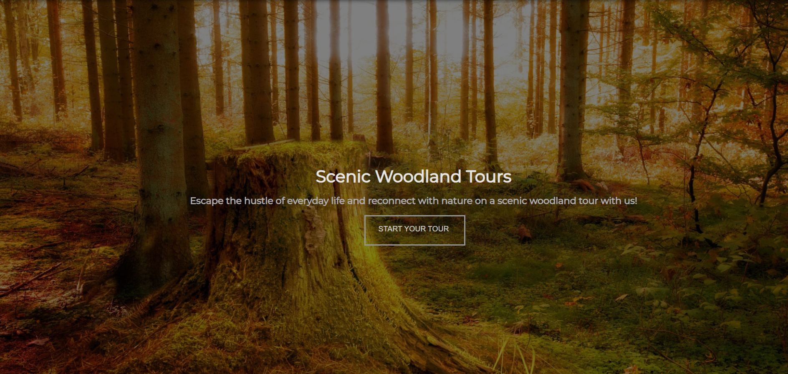

# Woodland Tours -  Mock Website

A mock up website for me to practice my HTML5 and CSS skills

Live Demo: https://your-live-link.com  
Frontend Repo: https://github.com/username/frontend-repo  

---

## Table of Contents

- [Overview](#overview)
- [Tech Stack](#tech-stack)
- [Screenshots](#screenshots)
- [Credits](#credits)
- [License](#license)

---

## Overview

This is a practical project to implement new skills and best practices.

### Learning Outcomes
- Built multi page website and style sheet

---

## Tech Stack

- HTML5
- CSS3

### Tools
- GitHub
- VS Code

---

## Screenshots

## Credits

Developer: Rory Horne
GitHub: https://github.com/RoryPHorne  

---

## License

This project is licensed under the MIT License.
